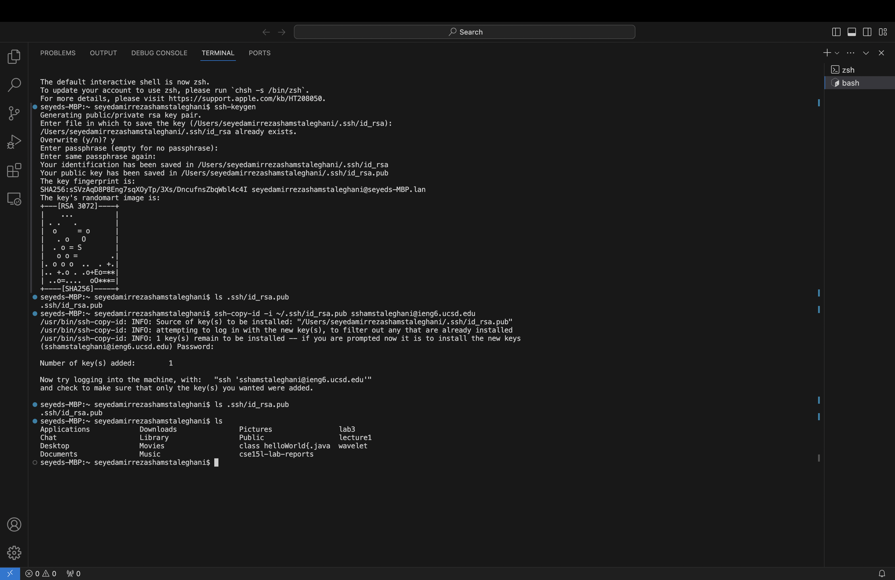
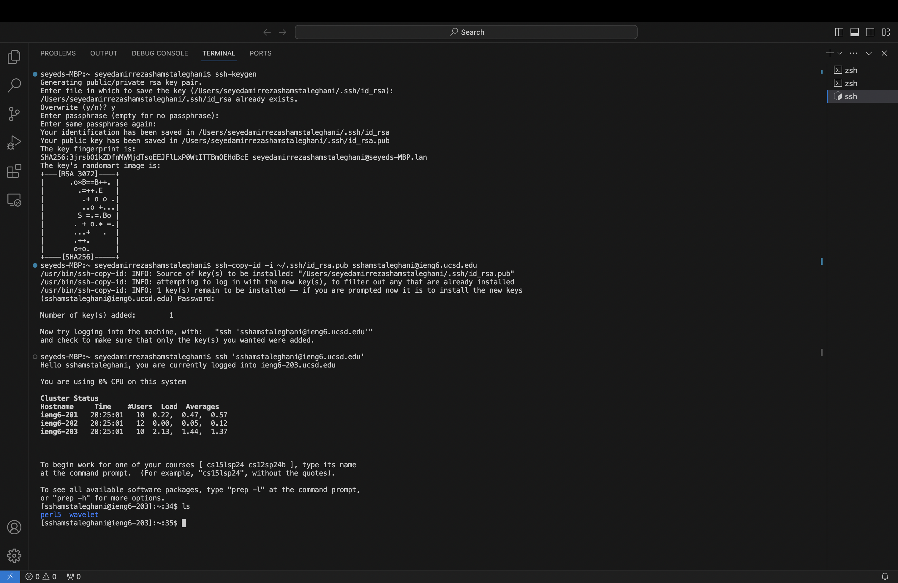
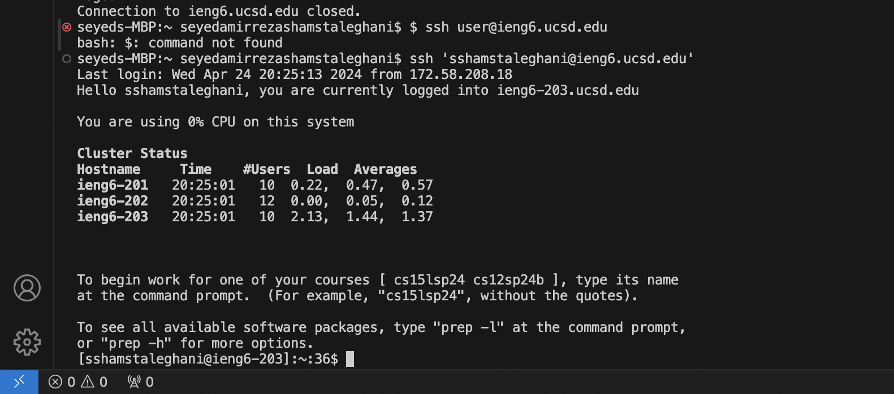

**Lab Report 2**
* **Part 2**

* **Part 3**
Most of the materials I learned in labs 3 and 2 were new for me. I learn how to connect to the SSH remote server and how to move files from remote server to my local computer which is going to be a big deal in the future in order to move informations from a place or a server. The materials we learned in lab of week 2 was also so interesting because of learning how to build a simple web server through github and publish that web so that others can see. Overall the materials were new for me but enjoyed every bit.
 
