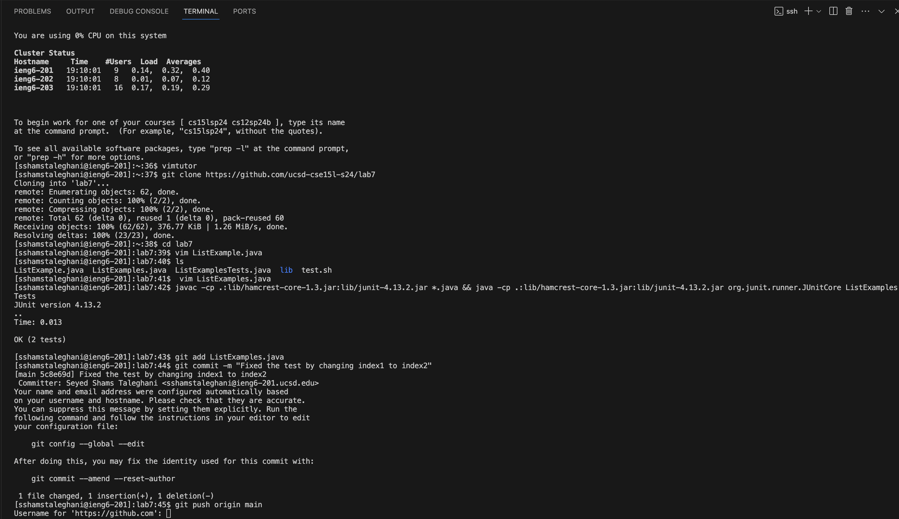

**LAB 4**

* 1- **Logged into `ieng6`:** `ssh<space>myusername@ieng6.ucsd.edu<enter>`
  **Explanation:** I logged into the ieng6 server using SSH.
  
* 2- **Ran vimtutor**: `vimtutor<enter>`
  **Explanation:** I started the vim tutorial.
  
* 3- **Cloned the repository**: `git<space>clone<space>https://github.com/ucsd-cse15l-s24/lab7<enter>`
  **Explanation:** Cloned the lab7 repository from GitHub.
  
* 4- **Navigated to the repository**: `cd<space>lab7<enter>`
  **Explanation:** I changed the directiry to lab7.
  
* 5- **Opened `ListExamples.java` in Vim**: `vim<space>ListExamples.java<enter>`
  **Explanation:** I opened the `ListExamples.java file` in `vim`.
  
* 6- **Edited the file in Vim**: `/index1<enter>n<esc>ciwindex2<esc>:wq<enter>`
  **Explanation:** Searched for `index1`, went to the next occurrence, entered insert mode, changed `index1` to `index2`, exited insert mode, saved the file, and quit vim.
`/index1<enter>:` Searches for the text `index1`.
`n`: Moves to the next occurrence of `index1`.
`<esc>`: Enters normal mode in vim.
`ciw`: Deletes the word under the cursor and enters insert mode.
`index2<esc>`: Replaces index1 with index2 and exits insert mode.
`:wq<enter>`: Saves the file and exits vim.

**OR** We can use **`i`** to go to the insert mode and find the `index1` we are looking for and change it to `index2`. 
  
* 7- **Ran the tests:** `<up><up><up><up><enter>, <up><up><up><up><enter>`
  **Explanation:** The **`javac -cp .:lib/hamcrest-core-1.3.jar:lib/junit-4.13.2.jar *.java`** command was 4 up in the search history, so I used the up arrow to access it and pressed Enter to run it. Then the **`java -cp .:lib/hamcrest-core-1.3.jar:lib/junit-4.13.2.jar org.junit.runner.JUnitCore ListExamplesTests`** command was also 4 up in the history, so I accessed and ran it in the same way.

* 8- **Committed and pushed the changes:** **`git<space>add<space>ListExamples.java<enter>git<space>commit<space>-m<space>"Fixed the test by changing index1 to index2"<enter>git<space>push<space>origin<space>main<enter>`**
  **Explanation:** Staged the changes, committed with a message, and pushed the changes to the GitHub repository.
`git<space>add<space>ListExamples.java<enter>`: Stages the changes to `ListExamples.java`.
`git<space>commit<space>-m<space>"Fixed the test by changing index1 to index2"<enter>`: Commits the staged changes with a descriptive message.
`git<space>push<space>origin<space>main<enter>`: Pushes the committed changes to the remote repository on **GitHub**.

  

