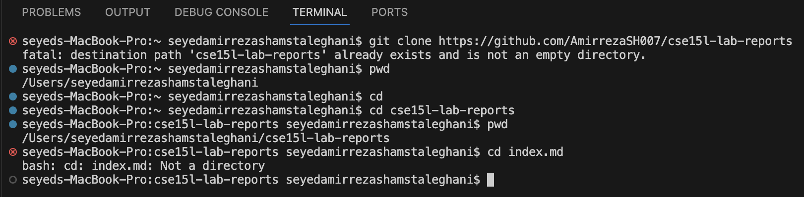
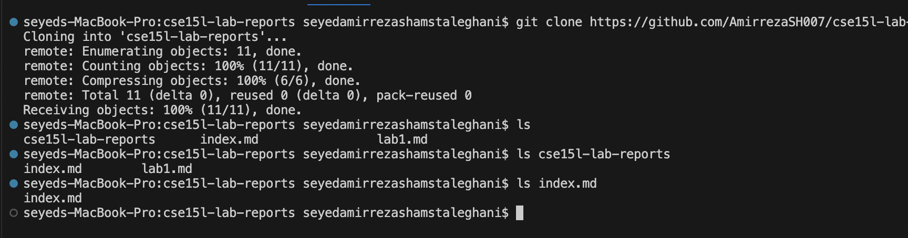
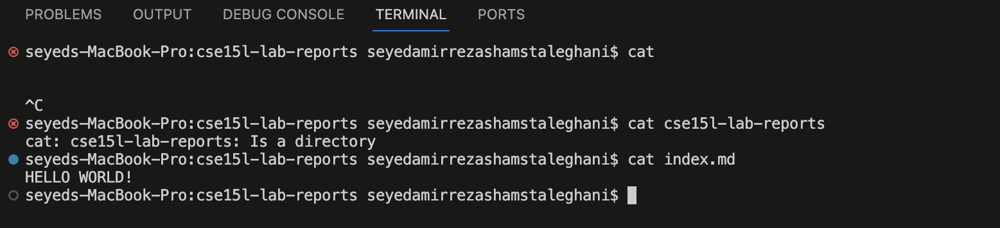

1) cd with no argument : Moves the current directory to the user's home directory. Output is not visible, but the working directory changes. /Users/seyedamirrezashamstaleghani when using pwd command. There will be no error.
2) cd with a path to a directory as an argument: /Users/seyedamirrezashamstaleghani/cse15l-lab-reports      Changes the current working directory to cse15l.lab.reports. There will be no error. Again, the output is not visible unless we use pwd command.
3) cd with a path to a file as an argument: It gives an error because cd can't navigate into file. Since index.md is a file and not a directory. cd is used to change directories not accessing files.

1) ls with no argument: shows the contents of the current directory which are the cse15l-lab-reports
and index.md and lab1.nd . There will be no error and the output is visible.
2) ls with a path to a directory as an argument: lists the contents of cse15l-lab-reports which are index.md and lab1.md . There will be no error and the output is visible.
3) ls with a path to a directory as an argument: There will be no error but when using ls index.md which is a file, the output will be the same as index.md .

1) cat with no argument: There will be no output and nothing happens as it's waiting for the user input which is a file name. There isn't going to be an error, but I used control C to stop it and continue using commands.
2) cat with a path to a directory as an argument: There will be an error as cat command is used to show the content in a file. Since cse15l-lab-reports is a directory the error also states that cse15l-lab-reports is a directory.
3) cat with a path to a file as an argument: We'll get an output which is the content of the index.md file. In this case the output is HELLO WORLD!. Since the index.md is file and not a directory and it has content inside, the command works and the output is visible.

