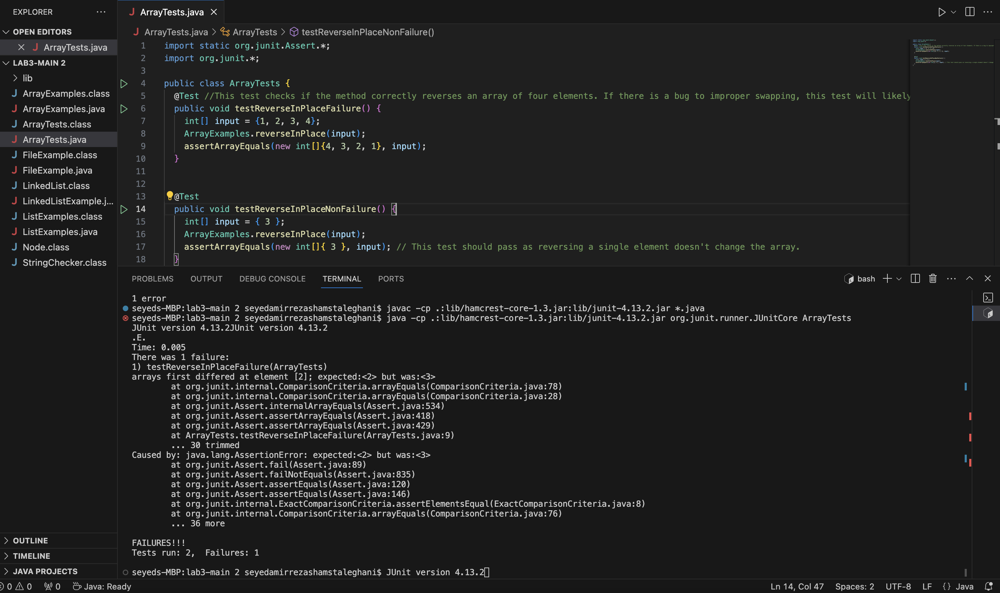

**PART 1)**
* #1) A failure-inducing input
  **`ArrayTests.java`**
  ```import org.junit.Test;
     import static org.junit.Assert.*;

     public class ArrayTests {
       @Test //This test checks if the method correctly reverses an array of four elements. If there is a bug to improper swapping, this test will likely fail.
       public void testReverseInPlaceFailure() {
         int[] input = {1, 2, 3, 4};
         ArrayExamples.reverseInPlace(input);
         assertArrayEquals(new int[]{4, 3, 2, 1}, input);
       }
     }``` 

* #2) An input that doesn't induce a failure
  ```@Test 
       public void testReverseInPlaceNonFailure() {
          int[] input = { 3 };
          ArrayExamples.reverseInPlace(input);
          assertArrayEquals(new int[]{ 3 }, input); // This test should pass as reversing a single element doesn't change the array.
       }```
* #3) 

* #4)
  ``` public class ArrayExamples {
        public static void reverseInPlace(int[] array) {
          for (int i = 0; i < array.length; i++) {
            int temp = array[i];
            array[i] = array[array.length - i]; 
            array[array.length - i] = temp;     
       }
     }
  }
```
 **Next**

  ```public class ArrayExamples {
       public static void reverseInPlace(int[] array) {
         for (int i = 0; i < array.length / 2; i++) {
            int temp = array[i];
            array[i] = array[array.length - 1 - i]; 
            array[array.length - 1 - i] = temp;     
        }
     }
```
* #5)
The fix addresses the issue by correctly using `array.length - 1 - i` for indexing, which correctly accesses the elements from the end of the array to swap with those at the beginning, without exceeding the array bounds. The loop only goes up to the middle of the array (`array.length / 2`), ensuring that each element is swapped only once, which efficiently reverses the array.

This change ensures that the method behaves correctly for all valid input sizes and types, including arrays with an even number of elements, which was where the original method failed.


  }
