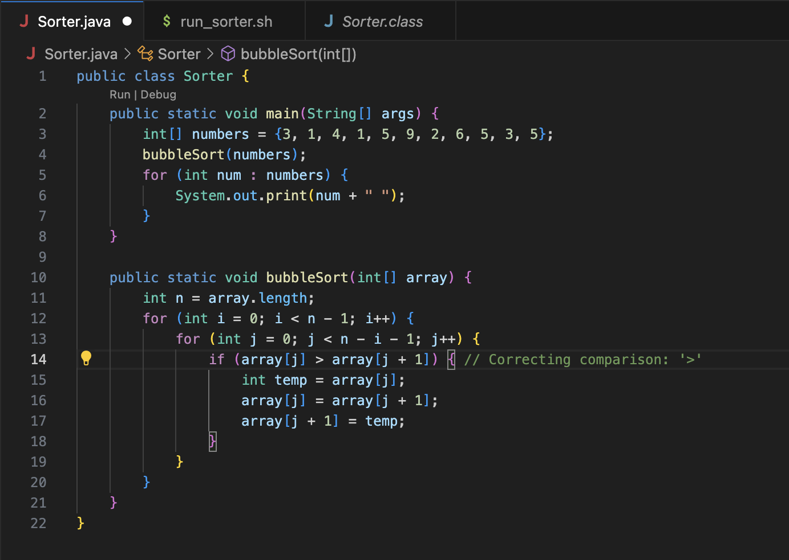

**Student Question:**
Hi everyone,

I'm having trouble with my Sorter.java program. I expect it to sort an array of integers, but it seems to be giving me incorrect results. 
I think the issue might be with my sorting logic or how I'm handling array indices.

Here is a screenshot of my terminal output:

In this example, I tried to sort the array [3, 1, 4, 1, 5, 9, 2, 6, 5, 3, 5], but the output is not sorted correctly.
Does anyone have any idea what might be going wrong?

**TA Response:**
It looks like there might be an issue with your sorting logic. Let's try to narrow down the problem.
You can add some debug print statements inside your sorting method to see how the array changes after each iteration.

**Student Response:**
Thanks for the suggestion! I added the debug print statement as you suggested.

 Here is the updated output:
It looks like the array is partially sorted, but some elements are still out of place after each pass.

From the debug output, I noticed that elements are not being compared correctly.

* **The directory of the code which was used to create the above story:**

* **The setup for `run_sorter.sh`**

* **The Fixed code after debugging and finding the error:**

* **The correct output after fixing the code and using `bash` to run:**

